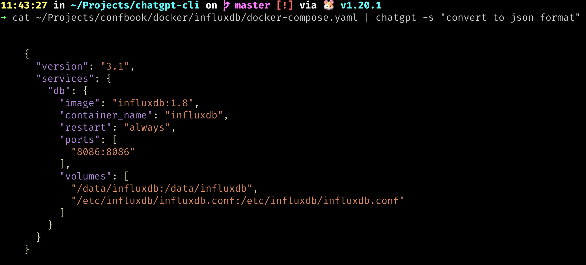
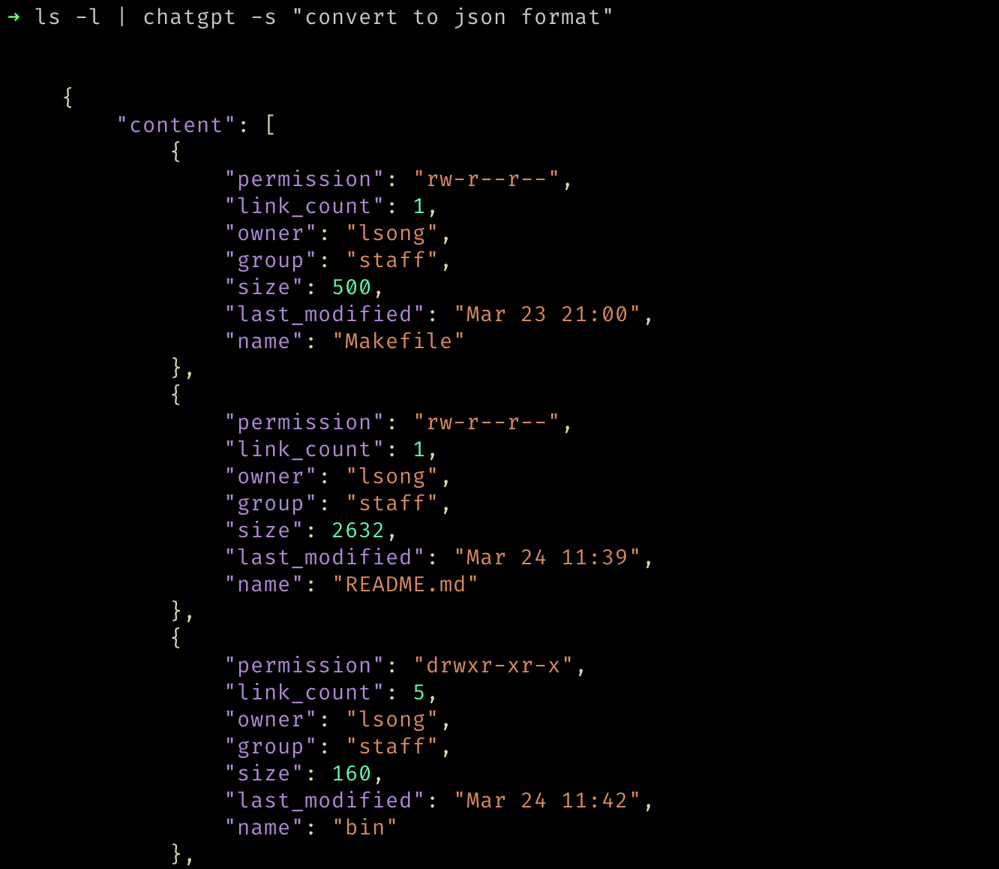
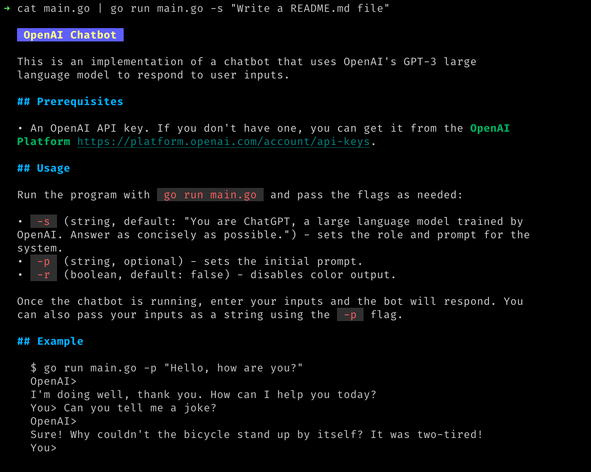

# chatgpt-cli

ChatGPT is a CLI tool that enables you to interact with OpenAI's GPT-3 model
using chat-style input. With ChatGPT, you can carry out a conversation with
the GPT-3 language model and get responses in natural language.

## Installation

```bash
bash -c "$(curl -s https://raw.githubusercontent.com/song940/chatgpt-cli/master/install.sh)"
```

Or download the source code and install the dependencies by running:

```bash
git clone https://github.com/song940/chatgpt-cli.git
go get github.com/charmbracelet/glamour
go get github.com/song940/openai-go/openai
go build # or make
```

## API Key

Before using the program, you need to provide an API key for OpenAI. You can find or create your API key by going to your [OpenAI dashboard](https://beta.openai.com/account/api-keys).

Set your API key as an environment variable:

```
export OPENAI_API_KEY=<your-api-key>
```

You can also set your OpenAI API endpoint as an environment variable (optional):

```
export OPENAI_API=https://api.openai.com/v1
```

## Usage

To start the program, run:

```bash
~$ chatgpt
You> Hi, what's your name?
OpenAI>
My name is ChatGPT. How can I assist you today?

You> Can you tell me a joke?
OpenAI>
Why did the tomato turn red? Because it saw the salad dressing!
```

Press `Ctrl^D` to end the conversation.

## Options

  The program accepts the following command line options:

  •  -p : The prompt to use.
  •  -s : The name of the system role (defaults to "You are ChatGPT, a large
  language model trained by OpenAI. Answer as concisely as possible.").
  •  -r : Disable color output.

Once the program is running, you can start a conversation by typing your prompt and hitting enter. 

```bash
~$ chatgpt -s "Now, you're useful code assistant"
You> hi
OpenAI>

  Hello! How can I assist you today?


You>
```

You can also use ChatGPT with piped input:

```bash
~$ echo "What is the meaning of life?" | chatgpt
OpenAI>
The meaning of life is subjective and varies from person to person. Some
may find purpose in their work, others in their relationships, and others in
their hobbies or spiritual beliefs.
```





```bash
~$ cat main.go | chatgpt -r -s "Write a README.md file" | tee README.md
```

## Acknowledgements

This program uses the following dependencies:

- [github.com/charmbracelet/glamour](https://github.com/charmbracelet/glamour) - for rendering markdown output
- [github.com/song940/openai-go/openai](https://github.com/song940/openai-go) - for communicating with OpenAI's API
